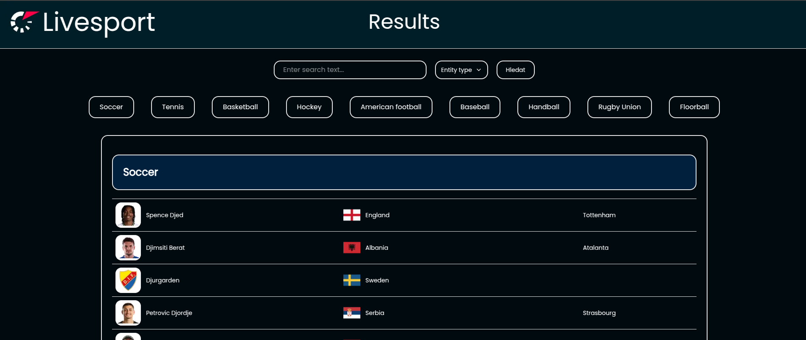
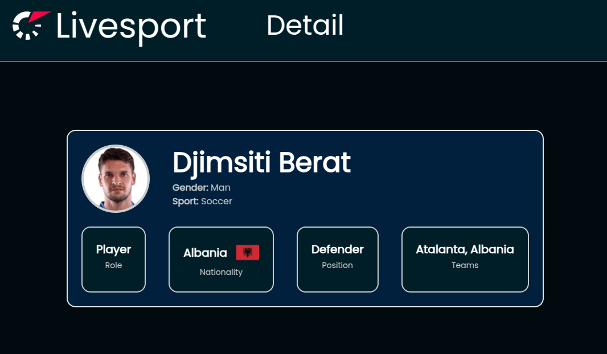

# Livesport - Web
### Web task for summer internship at Livesport

## Screenshots of app
* 
* 

## Setup - how to launch app using Docker
* **Requirements** - installed Docker, docker-compose
* Go to root of the project - `cd livesport-web/`
* Start the application - `docker-compose up`, you can put argument `-d` to run it on background
* The web app will be available at `http://localhost:3000`
* to end whole containerized app, just enter `Ctrl+C` on terminal where you launched it, if you launch application with `-d` argument then type to terminal `docker-compose down`

## Pages
* `/` - main page, showing table with entities
* `/detail/[typeEntity]/[name]/[id]` - detail page showing extra information about entity
  * `[typeEntity]` - must be one of these values `['tournament', 'team', 'individual-player', 'player-in-team']`
  * `[name]` - name of entity, corresponds to attribute `url` in API JSON response
  * `[id]` - id of entity, corresponds to attribute `id` in API JSON response

## Tests
* Tests can be found in folder `__tests__`
* Tests can be run using command `npm run test`

## Contact
* If you have some problem with code, app or other stuff related with this project, you can contact me on email [ratimec.david99@gmail.com](mailto:ratimec.david99@gmail.com) and I can help you :)